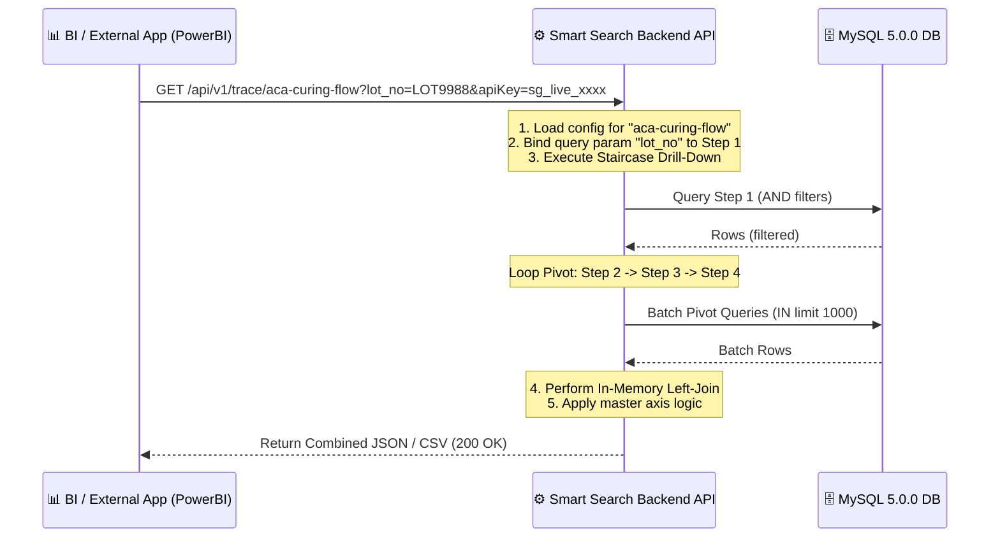

# 🔗 Architecture Proposal: Traceability Flow as a Service (Dynamic API Endpoints)

นี่คือสุดยอดไอเดียที่จะยกระดับ **Seagate Hookup Smart Pivot Search** จากแค่ "เครื่องมือดูข้อมูลหน้าเว็บ (Web Tool)" ให้กลายเป็น **"แกนกลางข้อมูลการผลิต (MES Traceability Hub)"** ของทั้งองค์กร! 

การแปลง **All Chains Combined** ให้กลายเป็น **Dynamic API Endpoints** จะช่วยให้ระบบภายนอก (เช่น PowerBI, WebApp ตัวอื่น, ระบบควบคุมเครื่องจักร Automation, หรือ BI Dashboards) สามารถดึงข้อมูลที่ผ่านการ Auto-Join ข้าม 12 ตารางนี้ได้ง่ายๆ ในเสี้ยววินาที

---

## 🗺️ 1. คอนเซปต์การทำงาน (The Concept Flow)



---

## 🌟 2. เจาะลึกความสามารถสุดยอด (Key Capabilities)

### 🎯 A. Dynamic Parameter Injection (พารามิเตอร์แบบไดนามิก)
API Endpoint จะไม่ใช่ข้อมูลดิบที่ฟิกซ์ค่าไว้ แต่รองรับ Query Parameters เพื่อเปลี่ยนค่าค้นหาของขั้นตอนแรก (Step 1) เช่น:
* `/api/v1/trace/bracket-assembly?hookup_sn=SN12345` ➔ ค้นหาเจาะจงเฉพาะ Serial Number นั้น
* `/api/v1/trace/bracket-assembly?aca_lot=LOT-AAA` ➔ ค้นหาประวัติล็อตการผลิตทั้งหมดของล็อตนั้น

### 📊 B. Multi-Format Output (รองรับหลายฟอร์แมต)
แอปพลิเคชันแต่ละตัวต้องการฟอร์แมตข้อมูลไม่เหมือนกัน API ของเราจะรองรับการแปลงร่างทันทีผ่าน Query String:
* `format=json` ➔ สำหรับ Web Application ทั่วไป
* `format=csv` ➔ ยอดเยี่ยมที่สุดสำหรับ **PowerBI / Excel** ดึงไปวาดกราฟได้ทันทีไม่ต้องแปลง
* `format=xlsx` ➔ ส่งออกเป็นไฟล์ดาวน์โหลด Excel โดยตรง

### 🔒 C. Enterprise Token Security (ระบบความปลอดภัย API Key)
* มีระบบสร้าง **API Keys** ประจำแต่ละทีม/แอปพลิเคชัน
* มีสิทธิ์ควบคุมและระบุได้ว่า API Key ตัวไหน เข้าถึง Endpoint เส้นไหนได้บ้าง

### ⚡ D. Cached Responses & TTL (ระบบแคชเพื่อถนอมฐานข้อมูล)
เนื่องจากตารางประวัติเป็นตารางโบราณและข้อมูลใหญ่มาก:
* สามารถตั้งค่า **Cache TTL** ได้ เช่น 5 นาที, 1 ชั่วโมง หรือ 1 วัน สำหรับ Endpoint ที่ข้อมูลไม่ค่อยเปลี่ยนแปลง
* เมื่อมีแอปอื่นมาเรียกซ้ำบ่อยๆ ระบบจะดึงจาก Memory Cache (เช่น Redis หรือ In-Memory Cache) ให้ทันทีโดยไม่ต้องรันคิวรี MySQL ใหม่ ช่วยป้องกัน Database ล่ม

### 📄 E. Self-Documenting Developer Panel (หน้าคู่มือการต่อใช้งาน)
ในหน้าเว็บหน้าบ้าน (Frontend) จะมีแถบพิเศษโชว์วิธีการต่อใช้งานสำหรับ Developer ท่านอื่น:
* โชว์คำสั่ง **cURL** สำเร็จรูป
* โชว์ลิงก์ดึงข้อมูลไปวางใน PowerBI
* โชว์โครงสร้างข้อมูลผลลัพธ์ (Response Schema JSON)

### ⚙️ F. Column Selector / Projection Management (เลือกเฉพาะคอลัมน์ที่จำเป็น)
เนื่องจากการ Left-Join ข้ามหลายตารางทำให้คอลัมน์ผลลัพธ์เยอะมาก (30-50 คอลัมน์):
* **ความคุมที่หน้าจอ (UI Control):** วิศวกรสามารถเลือกเอาเครื่องหมายถูก `[✓]` ติ๊กเลือกเฉพาะคอลัมน์สำคัญที่ต้องการแสดงและคัดคอลัมน์ขยะทิ้งได้ผ่านหน้าเว็บโดยตรง
* **ประสิทธิภาพการส่งออก (Clean Export):** เมื่อดาวน์โหลด Excel / CSV ข้อมูลจะถูกดึงไปเฉพาะคอลัมน์ที่เลือกเท่านั้น ทำให้ไฟล์สะอาด ไม่รกสายตา และพร้อมส่งรายงานผู้บริหารทันที
* **ประหยัด Bandwidth ขององค์กร (Payload Projection):** เมื่อแปลงเป็น API Endpoint ตัวชุดคำสั่งบันทึกจะจำไปเฉพาะฟิลด์คอลัมน์ที่เลือก (Select Projection) ทำให้เวลาส่งข้อมูลทางเครือข่ายไปให้ระบบอื่น ข้อมูลจะมีขนาดเล็ก เบา โหลดเร็ว ไม่ส่งข้อมูลส่วนที่ไม่จำเป็นไปด้วย

---

## 🛠️ 3. แผนผังการแก้ไขโครงสร้างโค้ด (Technical Roadmap)

### 🗄️ 1. เพิ่มตารางเก็บ Endpoint Config (Backend DB)
สร้างตารางใหม่ชื่อ `saved_endpoints` ในฐานข้อมูลเพื่อเซฟขั้นตอนการ Pivot:
```sql
CREATE TABLE saved_endpoints (
    id INT AUTO_INCREMENT PRIMARY KEY,
    slug VARCHAR(100) UNIQUE NOT NULL,       -- e.g., 'aca-laser-vmi-flow'
    name VARCHAR(255) NOT NULL,              -- e.g., 'รายงานประวัติกาวไปเลเซอร์ VMI'
    description TEXT,
    config JSON NOT NULL,                    -- เก็บ Array ของ chainSteps (ตาราง, คีย์เชื่อมโยง, master axis)
    created_at TIMESTAMP DEFAULT CURRENT_TIMESTAMP,
    updated_at TIMESTAMP DEFAULT CURRENT_TIMESTAMP ON UPDATE CURRENT_TIMESTAMP
);
```

### ⚙️ 2. สร้าง Generic Run-Chain Engine (Backend Service)
เขียนฟังก์ชันในหลังบ้านที่สามารถแกะ `config` ในฐานข้อมูลออกมา แล้วจำลองพฤติกรรมการคลิก Pivot ของหน้าบ้านทั้งหมดในระบบหลังบ้าน:
1. ดึงข้อมูลตารางตั้งต้น (Step 1) โดยแทนค่า `WHERE column = ?` ด้วยค่าที่ยิงเข้ามาใน URL Query Parameter
2. รันลูปดึงข้อมูลย้อนกลับเป็นทอดๆ (Step 2 ➔ Step N) ด้วยกลไก `1000-Batching` ที่เสถียรอยู่แล้วของ `PivotService`
3. เรียกฟังก์ชัน Left-Join (ย้าย Logic การรวมของ `useCombinedRows.js` ไปเขียนใน TypeScript Backend เพื่อให้หลังบ้านรวมแถวข้อมูลได้เองโดยไม่ต้องพึ่งเบราว์เซอร์)
4. คืนค่าตาม Format ที่ขอมา

---

## 💡 4. คำถามสำคัญเพื่อเปิดประเด็น (Key Discussion Points)

> [!TIP]
> 1. **ลำดับความสำคัญของแอปภายนอก:** องค์กรจะเริ่มนำข้อมูลตารางนี้ไปใช้ที่ไหนก่อนเป็นอันดับแรก? (เช่น ดึงเข้า PowerBI ของฝ่ายบริหาร หรือ ยิงส่งไปให้ระบบ Automation ของ LineACA?)
> 2. **รูปแบบการเก็บข้อมูล Endpoint:** เราต้องการปุ่ม **"💾 Save as API Endpoint"** บนหน้า Combined View เลยไหม? เพื่อให้วิศวกรที่จัดแต่งตารางเสร็จแล้วสามารถตั้งชื่อและกดสร้าง API จากหน้าจอได้ด้วยตัวเองทันที
